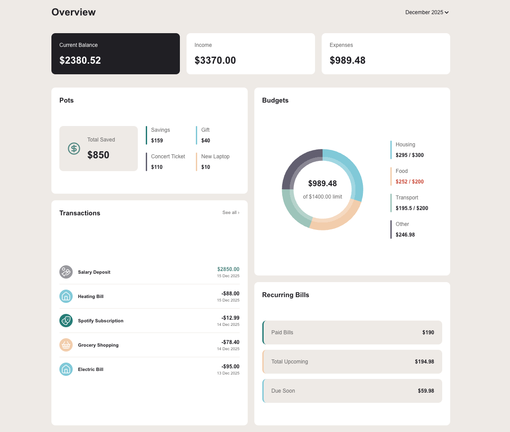

# Personal Finance Manager

A modern financial management application for tracking expenses, managing budgets, and achieving savings goals. Built with Next.js 16 and React 19 as part of a Frontend Mentor challenge.

**[Live Demo](https://financial-app-tau-puce.vercel.app)** | Inspired from 🎨 [Frontend Mentor Challenge](https://www.frontendmentor.io/challenges/personal-finance-app-JfjtZgyMt1)



## About the Project

This project started from a **Frontend Mentor** design challenge and was extended into a **full-featured**, **local-first** personal finance application with persistent storage, data import, and scalable architecture.

**What it does:** 
- Provides a comprehensive dashboard for managing transactions, tracking spending against category-based budgets, and monitoring progress toward savings goals.
- The app supports CSV imports for easy transaction data entry and offers monthly spending analytics.
- Local first using [SQLite Wasm](https://www.npmjs.com/package/@sqlite.org/sqlite-wasm) to store transactions.

**Why it exists:** Built to practice modern React patterns, TypeScript development, and responsive design while creating a practical tool for personal financial management.

**How it works:** Users import transactions via CSV (Ongoin development), which are automatically categorized. The dashboard provides real-time insights into spending patterns, budget utilization, and savings progress across customizable categories.

## Key Features

### Current Version

This project started from a Frontend Mentor design challenge and is extending into a full-featured, local-first personal finance application with persistent storage, data import, and scalable architecture.

- **Category-Based Budgets**: Track monthly budgets per category
- **Monthly Overview**: Visualize spending patterns and budget utilization
- **Dashboard Grid**: Responsive layout with key financial metrics
- **Pots (Savings Goals)**: Track progress toward savings targets
- **Balance Summary**: At-a-glance financial overview

### Planned Features

#### Active Development (dev branch)

🚧 Implementing SQLite WASM for local-first data persistence
🚧 CSV Import with automatic parsing and categorization
🚧 Full CRUD operations

#### Planned Features
- Pots (savings goals) management
- Recurring bills tracking
- Full page navigation
- Export / Import database
- UI improvements
- Unit testing

## Tech Stack

- **Framework**: Next.js 16 (App Router)
- **UI**: React 19, TypeScript, Tailwind CSS 4
- **Icons**: Lucide React
- **Features**: Server Components, CSS Modules

## Getting Started

```bash
# Install dependencies
pnpm install

# Run development server
pnpm run dev

# Build for production
pnpm run build
```

Open [http://localhost:3000](http://localhost:3000) to view the app.

## Project Structure

```
financial-app/
├── app/                    # Next.js App Router pages
├── src/
│   ├── components/         # React components
│   │   ├── ...
│   └── lib/               # Utilities and helpers
│   │
│   └── config/            # Config files
│   │
│   └── contexts/           # React Context providers
│   │
│   └── hooks/              # Reusable custom React hooks
│   │
│   └── helpers/            # Project-specific utility functions
│   │
│   └── types/              # Shared TypeScript type definitions
│   │
│   └── data/               # Mock/seed data for development
└── public/                # Static assets
```