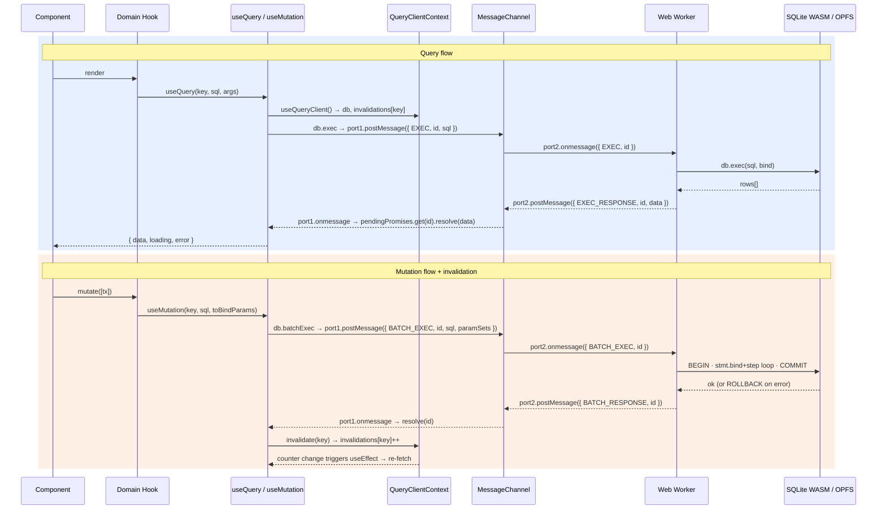

# Architecture

<!-- NOTE — Ordering rationale:
     Layers are ordered bottom-up (storage → transport → context → hooks → components).
     This mirrors the dependency graph: each layer only knows about the one below it.
     Reading top-to-bottom therefore gives you the full picture before you see how
     React consumes it. An alternative is top-down (component → DB), which is better
     for onboarding but hides the invariants. Bottom-up is recommended here because
     the interesting constraints (OPFS, MessageChannel, singleton) live at the bottom. -->

Note: Actual  doc present architecture ordered bottom-up (storage → transport → context → hooks → components).
While this is not bad and have this place i will prefer a more concetpual overview

-> presentation of different parts (local storage feature, query/mutation from db..)
-> i will create 2 sub-doc files:
    - in depth view of how sqlite wasm is working (worker, or they are speciallu handled in this projec (opfs, why, .. ), patching, etc)
    - strategy used to query database , update ui if db is mutated, limit, comparision with tantsack query...)
-> in this doc, keeping layer and their content is relevnat, idea is add doc file for in depth and rational and alternative

-> High level view:
- UI — components
- Query Hooks / Mutation Hooks — read/write split, shows the invalidation cycle
- QueryClientContext — React singleton, manages the db connection lifecycle
- SQLite — the actual data engine (WASM)
- OPFS mentioned as the persistence mechanism but not detailed here

## Overview

<!-- One paragraph: what the app is architecturally.
     Cover: no backend, all data in-browser, SQLite WASM + OPFS, offline-capable. -->

## Data Flow

## Layers

### 1. Storage — SQLite WASM + OPFS

<!-- Where: src/lib/db/db.worker.ts
     What to cover:
     - SQLite compiled to WASM, runs inside a Web Worker
     - OPFS (Origin Private File System) as the persistence backend
     - Fallback: transient in-memory DB when OPFS is unavailable
     - The conn state machine: "loading" | "opfs" | "local" | "error" -->

### 2. Worker Communication — MessageChannel

<!-- Where: src/lib/db/db.ts
     What to cover:
     - Why a MessageChannel is needed (workers are fire-and-forget, no return value)
     - port1 lives on the main thread, port2 is transferred to the worker
     - Each request gets an auto-incremented ID
     - Main thread stores a Map<id, resolve> of pending Promises
     - Worker echoes the ID back in the response → correct Promise is resolved
     - Two message types: EXEC (single query) and BATCH_EXEC (transactional batch) -->

### 3. DB Singleton — initDb()

<!-- Where: src/lib/db/db.ts
     What to cover:
     - initDb() must only spin up one Worker + one MessageChannel
     - initPromise guard prevents concurrent initialization races
     - Returns the Database object: { conn, exec, batchExec }
     - Schema creation happens here (known TODO: move to a migration layer) -->

### 4. Query Client — React Context

<!-- Where: src/contexts/QueryClientContext.tsx
     What to cover:
     - Calls initDb() on mount, exposes the db handle to the React tree
     - Seeds mock data on first run (temporary — will be removed when CSV import lands)
     - Provides: db, invalidations, invalidate(), errorDb
     - Context value is memoized to prevent unnecessary consumer re-renders -->

### 5. Invalidation System

<!-- Where: src/contexts/QueryClientContext.tsx + src/hooks/useQuery.hooks.ts
     What to cover:
     - invalidations is a Record<string, number> — one counter per table key
     - invalidate(key) increments the counter
     - useQuery includes the counter as a useEffect dependency
     - Counter increment → effect re-runs → SQL re-executed → UI updates
     - No external dependency (replaces React Query for this use case) -->

### 6. Generic Hooks — useQuery / useMutation

<!-- Where: src/hooks/useQuery.hooks.ts
     What to cover:
     - useQuery<T>(key, sql, args): returns { data, loading, error }
       - args serialized to JSON string to avoid infinite loops on array identity changes
       - skips execution while db.conn === "loading"
     - useMutation<T>(key, sql, toBindParams): returns { mutate, loading, error }
       - always uses batchExec (atomic, with rollback on failure)
       - calls invalidate(key) on success to trigger dependent queries -->

### 7. Domain Hooks — Transactions

<!-- Where: src/hooks/transactions.hooks.ts
     What to cover:
     - Thin wrappers that compose useQuery / useMutation with concrete SQL
     - List each hook with a one-line description of its SQL intent:
       useTransactionsGetSortedByDate, useAvailableMonths, useMonthTransactions,
       useMonthStats, useAddTransactions
     - All share the same invalidation key ("transactions") -->

---

## Why This Approach

### Why SQLite WASM over IndexedDB

IndexedDB is a key-value store with no query language. Expressing monthly aggregations, category groupings, or multi-condition filters requires either multiple round-trips or pushing that logic into JavaScript. SQLite lets you express those as a single SQL query and offload the computation to a mature, battle-tested engine. The WASM build adds ~1 MB to the bundle but eliminates an entire data-transformation layer.

### Why SQLite WASM over a server database

A server database requires infrastructure, authentication, and a network round-trip for every query. For a personal finance tool, this creates privacy concerns (financial data leaves the device) and operational overhead (hosting costs, uptime). SQLite WASM gives full SQL capabilities with zero server costs and works offline by default.

### Why a Web Worker

SQLite WASM is CPU-intensive on large queries. Running it on the main thread would block rendering and make the UI feel sluggish. Isolating it in a Worker keeps the main thread free for React reconciliation and user interactions. It also enforces a clean boundary: the rest of the app never imports SQLite directly, only the Worker does.

### Why MessageChannel over a simpler postMessage

`worker.postMessage` is one-way. To get a response, you need either a shared listener (which requires all callers to demultiplex messages themselves) or a dedicated channel per request (expensive). MessageChannel gives a persistent bidirectional port. Pairing it with a request ID map gives promise-based, type-safe query/response semantics without polling or shared mutable state.

### Why a custom invalidation system over React Query

React Query would add ~13 KB gzipped and require mapping its concept of "query keys" onto raw SQL strings. The invalidation needs here are simple: when a table changes, re-run any hook that reads from it. A counter-per-key stored in React state achieves this in ~20 lines and integrates directly with `useEffect` dependency arrays. No adapter layer, no abstraction mismatch.

### Why OPFS over localStorage / IndexedDB for persistence

localStorage is synchronous and capped at ~5 MB. IndexedDB is async but not designed for large binary blobs. OPFS (Origin Private File System) provides a sandboxed, high-performance file system API that SQLite's OPFS VFS can use to read and write the database file directly. This gives SQLite its normal file semantics (seek, write, fsync) with browser-native storage, with no size cap beyond available disk space.
